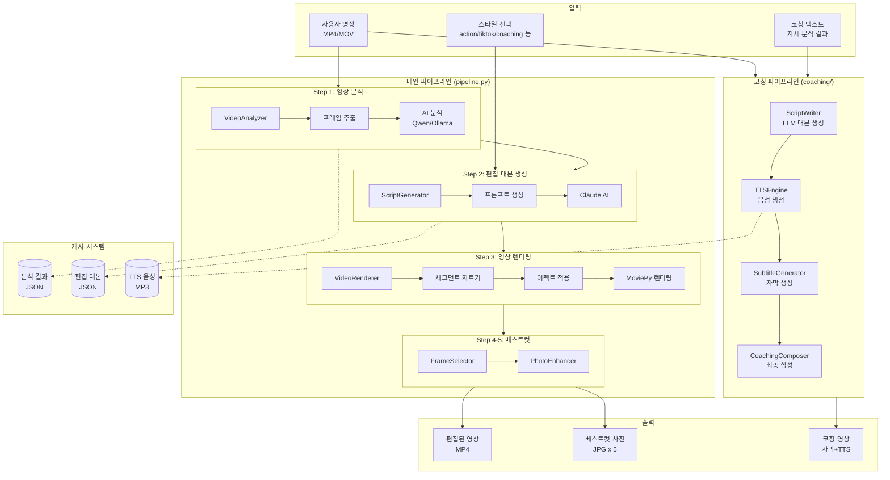
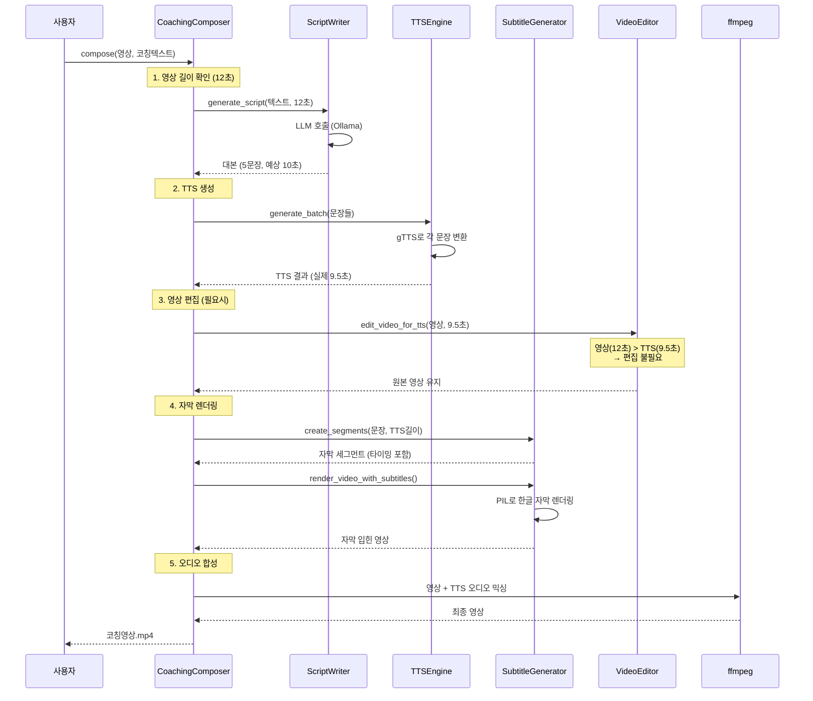
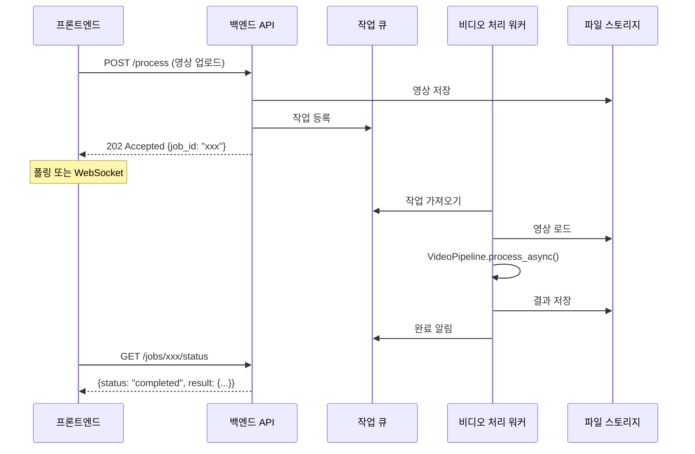

# 러닝 졸프 - 비디오/AI 파이프라인 모듈 인수인계 문서

> **작성일**: 2026-02-15
> **작성자**: 비디오/AI 파이프라인 담당

---

## 1. 개요 (Executive Summary)

### 이 모듈이 하는 일

**"러닝/운동 영상을 넣으면 → AI가 자동으로 숏폼 영상 + 베스트컷 사진을 만들어주는 시스템"**

1. 사용자가 러닝하면서 찍은 영상을 업로드하면
2. AI가 영상을 분석해서 "어디가 멋있는 장면인지" 파악하고
3. 자동으로 10초~30초짜리 숏폼 영상을 편집해주고
4. 가장 잘 나온 사진 5장을 뽑아서 보정까지 해줌


### 현재 상태

| 항목 | 상태 |
|------|------|
| 완성도 | **90%** - 핵심 기능 모두 동작 |
| 테스트 | CLI에서 수동 테스트 완료 |
| 알려진 이슈 | 아래 "알려진 이슈" 섹션 참고 |

---

## 2. 아키텍처 개요

### 2.1 시스템 구성도



### 2.2 데이터 흐름 (쉬운 설명)

```
[입력]                    [처리]                         [출력]
━━━━━━━━━━━━━━━━━━━━━━━━━━━━━━━━━━━━━━━━━━━━━━━━━━━━━━━━━━━━━━━━━

러닝 영상 ─────┐
(3분짜리)      │
               ▼
            ┌─────────────────────────────────────┐
            │  Step 1: 영상 분석                   │
            │  "이 영상에서 뭐가 일어나고 있지?"    │
            │                                     │
            │  - 2초마다 프레임 캡처               │
            │  - AI가 각 프레임 분석               │
            │  - "0:15에 점프, 1:30에 웃는 얼굴"   │
            └─────────────────────────────────────┘
                           │
                           ▼
            ┌─────────────────────────────────────┐
            │  Step 2: 편집 대본 생성              │
            │  "어떻게 편집할까?"                  │
            │                                     │
            │  - Claude AI가 분석 결과 보고        │
            │  - "0:15 점프를 슬로우모션으로"      │
            │  - "1:30 웃는 얼굴을 줌인"           │
            └─────────────────────────────────────┘
                           │
                           ▼
            ┌─────────────────────────────────────┐
            │  Step 3: 영상 렌더링                 │
            │  "실제로 편집 실행"                  │
            │                                     │
            │  - 대본대로 영상 자르기              │  ──▶  편집된 영상
            │  - 슬로우모션, 색보정 적용           │       (10초)
            │  - 하나로 합치기                     │
            └─────────────────────────────────────┘
                           │
                           ▼
            ┌─────────────────────────────────────┐
            │  Step 4-5: 베스트컷                  │
            │  "가장 잘 나온 사진 뽑기"            │
            │                                     │
            │  - 구도, 표정, 선명도 점수 계산      │  ──▶  베스트컷 사진
            │  - 상위 5장 선별                     │       (JPG x 5)
            │  - 색감 보정                         │
            └─────────────────────────────────────┘
```

### 2.3 코칭 파이프라인 (별도)

```
[입력]                    [처리]                         [출력]
━━━━━━━━━━━━━━━━━━━━━━━━━━━━━━━━━━━━━━━━━━━━━━━━━━━━━━━━━━━━━━━━━

러닝 영상 ─────┐
               │
자세 분석 ─────┤
텍스트         │
"어깨 힘 빼세요"│
               ▼
            ┌─────────────────────────────────────┐
            │  1. LLM 대본 생성                    │
            │  - 영상 길이에 맞게 문장 조절        │
            │  - "어깨 힘 빼세요" (2초)            │
            │  - "팔은 옆으로 리듬만" (2.5초)      │
            └─────────────────────────────────────┘
                           │
                           ▼
            ┌─────────────────────────────────────┐
            │  2. TTS 음성 생성                    │
            │  - Google TTS로 한국어 음성 생성     │
            │  - 각 문장별 MP3 파일                │
            └─────────────────────────────────────┘
                           │
                           ▼
            ┌─────────────────────────────────────┐
            │  3. 자막 생성                        │
            │  - TTS 길이에 맞춰 자막 타이밍 계산  │  ──▶  코칭 영상
            │  - 한글 자막 렌더링 (PIL 사용)       │       (자막 + 음성)
            └─────────────────────────────────────┘
                           │
                           ▼
            ┌─────────────────────────────────────┐
            │  4. 최종 합성                        │
            │  - 영상 + 자막 + TTS 오디오 합치기   │
            │  - ffmpeg로 렌더링                   │
            └─────────────────────────────────────┘
```

### 2.4 외부 의존성

| 카테고리 | 라이브러리/서비스 | 용도 | 필수 여부 |
|----------|------------------|------|----------|
| **AI 모델** | Ollama + qwen2.5vl:7b | 영상 분석 (로컬) | 택1 필수 |
| | Claude API | 편집 대본 생성 | 택1 필수 |
| | Claude Code CLI | 편집 대본 생성 (API 키 불필요) | 택1 필수 |
| **영상 처리** | MoviePy | 영상 렌더링 | 필수 |
| | OpenCV | 이미지 처리 | 필수 |
| | ffmpeg | 영상 인코딩 | 필수 (시스템 설치) |
| **TTS** | gTTS | 한국어 음성 생성 | 코칭용 |
| | pyttsx3 | 오프라인 TTS (폴백) | 선택 |
| **기타** | MediaPipe | 피사체 추적 (스마트 리프레임) | 선택 |
| | Pillow | 한글 자막 렌더링 | 코칭용 |

---

## 3. 모듈 상세 설명

### 3.1 비디오 처리 파이프라인

#### 담당 기능
원본 영상 → AI 분석 → 자동 편집 → 최종 렌더링

#### 주요 클래스와 역할

| 클래스 | 파일 | 역할 | 비유 |
|--------|------|------|------|
| `VideoPipeline` | `pipeline.py` | **총괄 지휘자** - 전체 흐름 조율 | 영화 감독 |
| `VideoAnalyzer` | `analyzers/video_analyzer.py` | **분석가** - 영상 내용 파악 | 스토리보드 작가 |
| `ScriptGenerator` | `directors/script_generator.py` | **대본가** - 편집 계획 수립 | 시나리오 작가 |
| `VideoRenderer` | `renderers/video_renderer.py` | **편집자** - 실제 영상 편집 | 비디오 에디터 |
| `FrameSelector` | `photographers/frame_selector.py` | **사진작가** - 베스트컷 선별 | 포토그래퍼 |
| `PhotoEnhancer` | `photographers/photo_enhancer.py` | **리터처** - 사진 보정 | 포토샵 전문가 |

#### 입출력 형식

```python
# 입력
{
    "video_path": "러닝영상.mp4",      # 원본 영상 경로
    "style": "action",                 # 편집 스타일
    "target_duration": 10,             # 목표 길이 (초)
    "photo_count": 5,                  # 베스트컷 개수
    "photo_preset": "sports_action"    # 사진 보정 프리셋
}

# 출력 (ProcessingResult)
{
    "output_video": "outputs/videos/영상_action_10s_20260215.mp4",
    "output_photos": [
        "outputs/photos/영상_best_001.jpg",
        "outputs/photos/영상_best_002.jpg",
        ...
    ],
    "analysis_summary": "영상 분석 결과 요약...",
    "processing_time": 45.2  # 초
}
```

### 3.2 코칭 파이프라인

#### 담당 기능
자세 분석 텍스트 → 코칭 대본 → TTS 음성 → 자막 영상 생성

#### 주요 클래스와 역할

| 클래스 | 파일 | 역할 |
|--------|------|------|
| `CoachingComposer` | `coaching/coaching_composer.py` | **총괄** - 코칭 영상 전체 파이프라인 |
| `CoachingScriptWriter` | `coaching/script_writer.py` | **대본가** - LLM으로 코칭 대본 생성 |
| `TTSEngine` | `coaching/tts_engine.py` | **성우** - 텍스트 → 음성 변환 |
| `SubtitleGenerator` | `coaching/subtitle_generator.py` | **자막팀** - 자막 생성 및 타이밍 |
| `SubtitleRenderer` | `coaching/subtitle_generator.py` | **합성팀** - 자막을 영상에 렌더링 |
| `CoachingVideoEditor` | `coaching/video_editor.py` | **편집자** - 영상 길이 조절 (슬로우모션) |

#### 코칭 파이프라인 상세 흐름



### 3.3 AI 추론 파이프라인

#### 사용 모델

| 용도 | 모델 | 선택 이유 |
|------|------|----------|
| **영상 분석** | qwen2.5vl:7b (Ollama) | 로컬 실행 가능, 이미지 이해 능력 우수, 무료 |
| **편집 대본** | Claude Sonnet | 복잡한 지시 이해, 구조화된 JSON 출력 |
| **코칭 대본** | qwen2.5vl:7b | 로컬 실행, 간단한 텍스트 변환 |

#### 추론 흐름

```
영상 분석:
┌─────────────────────────────────────────────────────────────┐
│  프레임 추출 (2초마다)                                       │
│       ↓                                                     │
│  각 프레임 → Base64 인코딩                                   │
│       ↓                                                     │
│  Ollama API 호출 (병렬 처리)                                 │
│  "이 러닝 영상 프레임을 분석해줘"                             │
│       ↓                                                     │
│  JSON 응답 파싱                                              │
│  {action: "점프", emotion: "기쁨", score: 8.5}              │
└─────────────────────────────────────────────────────────────┘

편집 대본 생성:
┌─────────────────────────────────────────────────────────────┐
│  분석 결과 + 스타일 프롬프트 조합                            │
│       ↓                                                     │
│  Claude API/CLI 호출                                        │
│  "action 스타일로 10초 영상 편집해줘"                        │
│       ↓                                                     │
│  EditScript JSON 응답                                       │
│  {segments: [{start: 0.5, end: 2.0, speed: 0.5, ...}]}     │
└─────────────────────────────────────────────────────────────┘
```

#### 성능 특성

| 단계 | 처리 시간 | 메모리 | 비고 |
|------|----------|--------|------|
| 영상 분석 | 30초~2분 | 4GB+ | 프레임 수에 비례, GPU 권장 |
| 대본 생성 | 5~15초 | 1GB | API 응답 시간 |
| 영상 렌더링 | 20초~1분 | 2GB+ | 영상 길이/해상도에 비례 |
| TTS 생성 | 5~10초 | 500MB | 문장 수에 비례 |

---

## 4. 백엔드 통합 가이드

### 4.1 인터페이스 정의

#### 메인 파이프라인 호출

```python
from src.pipeline import VideoPipeline
from src.core.models import OutputConfig

# 파이프라인 초기화
pipeline = VideoPipeline(
    use_local=True,           # 로컬 모델 사용 (Ollama)
    ollama_model="qwen2.5vl:7b",
    use_mock=False,           # 실제 AI 사용
    use_cache=True            # 캐시 활성화
)

# 영상 처리 (동기)
result = pipeline.process_sync(
    video_path="input.mp4",
    style="action",
    target_duration=10,
    output_dir="outputs",
    photo_count=5,
    photo_preset="sports_action"
)

# 결과 확인
print(result.output_video)   # "outputs/videos/input_action_10s_xxx.mp4"
print(result.output_photos)  # ["outputs/photos/input_best_001.jpg", ...]
```

#### 코칭 파이프라인 호출

```python
from src.coaching import CoachingComposer

# 컴포저 초기화
composer = CoachingComposer(
    tts_enabled=True,
    subtitle_enabled=True,
    use_llm_script=True,      # LLM으로 대본 생성
    llm_model="qwen2.5vl:7b"
)

# 코칭 영상 생성
output_path = composer.compose(
    input_video="input.mp4",
    coaching_text="""
    상체가 굳어 있어요. 어깨 힘 빼세요.
    팔이 앞에서 흔들려요. 옆으로 리듬만 주세요.
    보폭 줄이고 템포 올리면 편해질 거예요.
    """,
    output_video="output_coaching.mp4"
)
```

#### 요청/응답 JSON 스키마

```json
// 요청 (REST API로 감쌀 경우)
{
    "video_path": "/uploads/video123.mp4",
    "mode": "auto_edit",  // "auto_edit" | "coaching"
    "options": {
        // auto_edit 모드
        "style": "action",
        "target_duration": 10,
        "photo_count": 5,
        "photo_preset": "sports_action",

        // coaching 모드
        "coaching_text": "어깨 힘 빼세요...",
        "tts_enabled": true
    }
}

// 응답
{
    "success": true,
    "result": {
        "output_video": "/outputs/videos/xxx.mp4",
        "output_photos": ["/outputs/photos/xxx_001.jpg", ...],
        "processing_time": 45.2,
        "analysis_summary": "..."
    },
    "error": null
}
```

### 4.2 통합 시나리오

#### 권장 호출 방식

```python
# 방법 1: 동기 호출 (간단, 블로킹)
result = pipeline.process_sync(...)

# 방법 2: 비동기 호출 (권장, 논블로킹)
import asyncio

async def process_video():
    result = await pipeline.process_async(...)
    return result

# 백그라운드 태스크로 실행
asyncio.create_task(process_video())
```

#### 비동기 처리 권장 구조



#### 에러 핸들링

```python
from src.core.exceptions import (
    VideoProcessingError,
    AnalysisError,
    RenderingError,
    ConfigurationError
)

try:
    result = pipeline.process_sync(...)
except ConfigurationError as e:
    # 설정 오류 (API 키 없음, 모델 없음 등)
    return {"error": "configuration", "message": str(e)}
except AnalysisError as e:
    # AI 분석 실패
    return {"error": "analysis", "message": str(e)}
except RenderingError as e:
    # 영상 렌더링 실패
    return {"error": "rendering", "message": str(e)}
except VideoProcessingError as e:
    # 기타 처리 오류
    return {"error": "processing", "message": str(e)}
```

### 4.3 환경 설정

#### 필요한 환경변수 (.env)

```bash
# AI API 키 (로컬 모드 사용 시 불필요)
ANTHROPIC_API_KEY=sk-ant-xxx        # Claude API (옵션)
DASHSCOPE_API_KEY=xxx               # Qwen API (옵션)

# Ollama 설정 (로컬 모드)
OLLAMA_HOST=http://localhost:11434  # 기본값

# 출력 설정
OUTPUT_DIR=outputs                   # 기본 출력 디렉토리
CACHE_DIR=outputs/cache             # 캐시 디렉토리
```

#### 의존성 설치

```bash
# 1. Python 패키지
pip install -r requirements.txt

# 2. 시스템 의존성
# macOS
brew install ffmpeg

# Ubuntu
apt-get install ffmpeg

# 3. Ollama 설치 (로컬 AI)
# https://ollama.ai 에서 설치
ollama pull qwen2.5vl:7b    # 약 6GB

# 4. 한글 폰트 (코칭 자막용)
# macOS: 기본 설치됨 (AppleSDGothicNeo)
# Ubuntu: apt-get install fonts-noto-cjk
```

#### GPU/리소스 요구사항

| 모드 | CPU | RAM | GPU | 디스크 |
|------|-----|-----|-----|--------|
| 최소 (Mock) | 2코어 | 4GB | 불필요 | 1GB |
| 로컬 (Ollama) | 4코어 | 16GB | 권장 (8GB VRAM) | 10GB |
| API 모드 | 2코어 | 8GB | 불필요 | 5GB |

---

## 5. 실행 및 테스트

### 5.1 로컬에서 단독 실행

```bash
# 디렉토리 이동
cd video-editor

# 기본 실행 (action 스타일, 10초)
python main.py input.mp4 -d 10 -s action --local

# 코칭 모드
python main.py input.mp4 -s coaching --coaching-text "어깨 힘 빼세요. 팔은 옆으로."

# 테스트 모드 (AI 없이 더미 데이터)
python main.py input.mp4 -d 10 -s action --mock

# 도움말
python main.py --help
```

### 5.2 테스트 방법과 예상 결과

```bash
# 1. Mock 모드 테스트 (AI 없이)
python main.py test-move.MOV -d 10 -s action --mock

# 예상 결과:
# - outputs/videos/test-move_action_10s_xxx.mp4 생성
# - outputs/photos/test-move_best_001~005.jpg 생성
# - 처리 시간: 10~20초

# 2. 로컬 AI 테스트
python main.py test-move.MOV -d 10 -s action --local

# 예상 결과:
# - AI 분석 로그 출력
# - 처리 시간: 1~3분

# 3. 코칭 모드 테스트
python main.py test-move.MOV -s coaching --coaching-text "테스트 문장입니다."

# 예상 결과:
# - TTS 음성 생성 로그
# - 자막 렌더링 로그
# - outputs/videos/test-move_coaching_xxx.mp4 생성
```

### 5.3 샘플 데이터 위치

```
video-editor/
├── test-move.MOV          # 테스트용 러닝 영상 (12초)
├── test2.MOV              # 테스트용 영상 2
├── test3.MOV              # 테스트용 영상 3
└── outputs/
    ├── videos/            # 생성된 영상들
    ├── photos/            # 생성된 사진들
    └── cache/             # 캐시된 분석 결과
```

---

## 6. 알려진 이슈 & TODO

### 6.1 현재 한계점

| 이슈 | 설명 | 영향도 | 우회 방법 |
|------|------|--------|----------|
| **Ollama 모델 크기** | qwen2.5vl:7b가 6GB라 처음 로드 시 느림 | 중 | 서버 시작 시 미리 로드 |
| **TTS 품질** | gTTS가 약간 로봇 같음 | 낮 | Edge TTS 또는 유료 TTS 고려 |
| **긴 영상** | 3분 이상 영상은 분석 시간 오래 걸림 | 중 | 프레임 샘플링 간격 조절 |
| **세로 영상** | 일부 세로 영상에서 리프레임 오류 | 낮 | 수동으로 output_ratio 지정 |

### 6.2 추후 개선 필요한 부분

```
우선순위 높음:
□ 자동화 테스트 작성 (pytest)
□ 에러 로깅 강화 (파일 로그)
□ 진행 상황 콜백 추가 (프론트엔드 연동용)

우선순위 중간:
□ 배치 처리 지원 (여러 영상 동시)
□ 영상 미리보기 생성
□ 처리 취소 기능

우선순위 낮음:
□ GPU 가속 최적화
□ 더 다양한 편집 스타일
□ 음악 자동 추가
```

### 6.3 주의사항

```
⚠️ 중요한 주의사항:

1. ffmpeg 필수 설치
   - 시스템에 ffmpeg가 없으면 렌더링 실패
   - 설치 확인: ffmpeg -version

2. Ollama 서버 실행 필요
   - 로컬 모드 사용 시 ollama serve 실행 상태여야 함
   - 모델 미리 다운로드: ollama pull qwen2.5vl:7b

3. 한글 폰트 필요 (코칭 모드)
   - macOS: 기본 폰트 사용
   - Linux: fonts-noto-cjk 설치 필요

4. 메모리 관리
   - 큰 영상 처리 시 메모리 부족 가능
   - 16GB RAM 권장

5. 캐시 관리
   - outputs/cache가 커질 수 있음
   - 주기적으로 정리 필요
```

---

## 7. 연락처 & 추가 자료

### 질문 있을 때

- **카카오톡**: [담당자 연락처]
- **이메일**: [담당자 이메일]
- **응답 시간**: 평일 10시~22시

### 관련 참고 자료

| 자료 | 링크 | 설명 |
|------|------|------|
| MoviePy 문서 | https://zulko.github.io/moviepy/ | 영상 렌더링 |
| Ollama 문서 | https://ollama.ai/docs | 로컬 AI 모델 |
| Claude API | https://docs.anthropic.com | 대본 생성 |
| gTTS | https://gtts.readthedocs.io | TTS 음성 |
| ffmpeg | https://ffmpeg.org/documentation.html | 영상 인코딩 |

### 프로젝트 구조 빠른 참조

```
핵심 파일만 보기:

main.py                 ← CLI 진입점, 여기서 시작
src/pipeline.py         ← 전체 흐름 조율
src/coaching/           ← 코칭 기능 전체
  coaching_composer.py  ← 코칭 메인 로직

설정 파일:
configs/script_prompts.yaml   ← 편집 스타일별 프롬프트
configs/output_specs.yaml     ← 출력 해상도/비율

테스트:
python main.py test-move.MOV -d 10 -s action --mock
```

---

**문서 끝**

> 이 문서는 2026-02-15 기준으로 작성되었습니다.
> 코드 변경 시 문서도 함께 업데이트해주세요.
